<h1>City Population Data Manager</h1>

Dependencies:
* Docker
* Postgresql
* Maven
* Java 8

This application provides an example of how to integrate multiple data formats of city population data and manage the flow of data.
Data is automatically ingested from json, avro, and csv files that adhere to the City Population data schema below.

There are three source files. **CityListA.json**, **CityListB.avro**, and **CityListC.csv**.
They each contain data in three columns (the data schema):

  * name:string
  * code:string
  * Population:long

All ingested data is standardized to the avro serialization format.

* This enables schema evolution, which ensures that changes to the schema do not break the flow of data to dependencies.

* A JDBC database instance is required to run this application, which is currently configured to use PostgreSQL
* If [Docker](https://www.docker.com/get-started) is installed, a postgresql instance can be started with:
```$xslt
docker run --name some-postgres -e POSTGRES_PASSWORD=postgrespw -d postgres
```

Point the application to the jdbc instance by updating: 
 [application.yml](src/main/resources/application.yml):

```
  ...
  datasource:
       driver-class-name: org.postgresql.Driver
       url: jdbc:postgresql://localhost:5432/postgres
       username: postgresuser
       password: postgrespw
```

Build and start the application:
```
mvn clean package
java -jar target/population-data-manager-1.0-SNAPSHOT.jar
```

# Walkthrough: Example Usage

**Navigate to Populations Manager REST API front-end:**
 http://localhost:8090

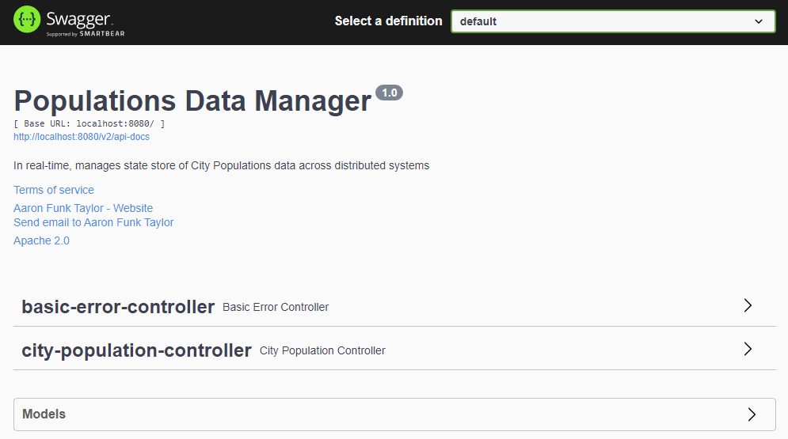

...

**Select "city-population-controller" to drop down the REST API to control the population data:**

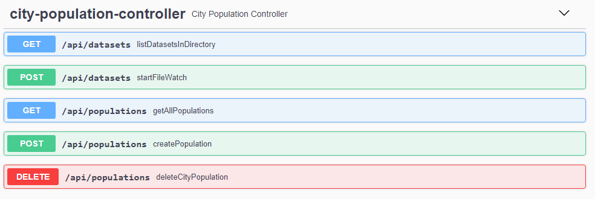

...

**List all data sets in ingestion watch directory.**

**When the watcher is enabled, data sets in the directory, as well as 
new data sets of types *avro*, *json*, *csv* dropped into this directory, are automatically persisted**
**(Data sets require strict adherence to City Population data schema):**

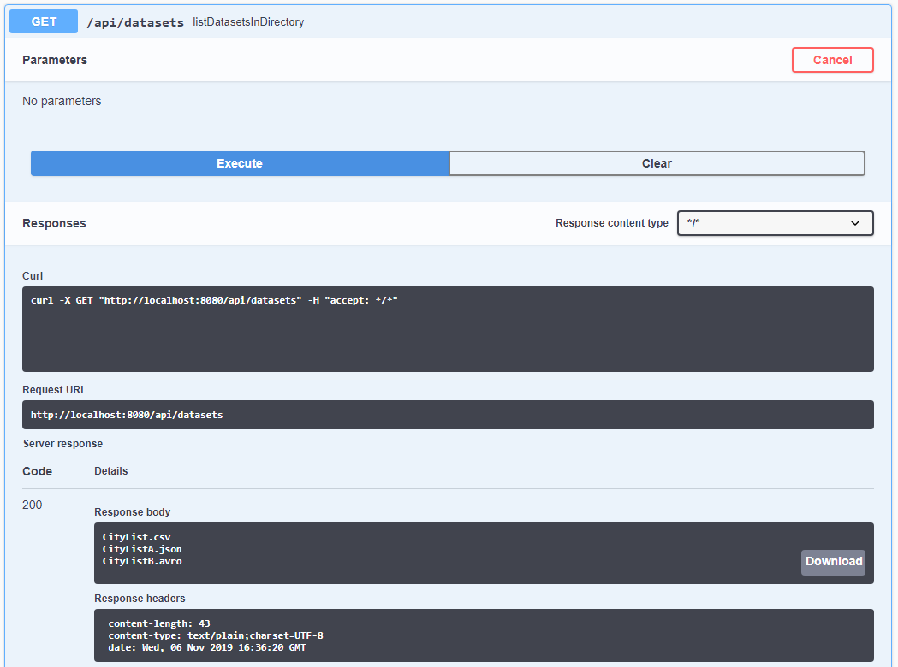

...

**Query all populations prior to turning the directory watcher on. This should be empty:**

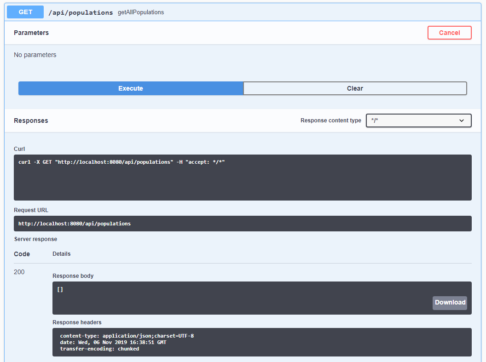

...

**Turn on the Directory Watcher to automatically persist data to the database.**
* HTTP Response needs to be updated -- THIS CALL HANGS, SO CANCEL REST request afterward!
* The watcher will remain enabled even after canceling the REST call
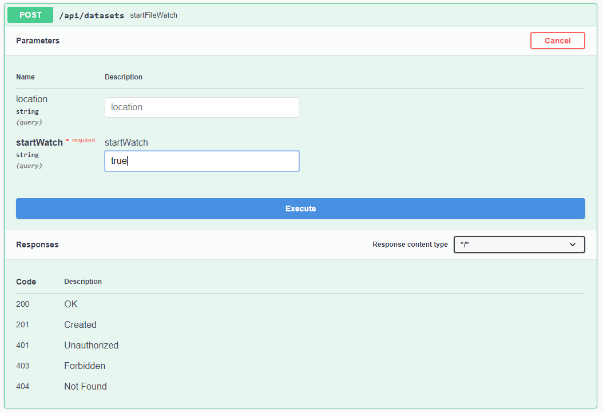

...

**Query all populations after enabling watcher:**
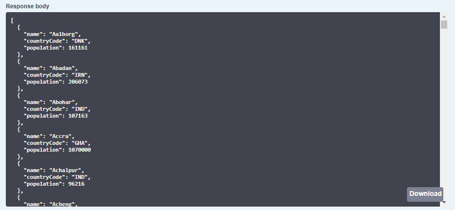

...

**Create or update a population in the database:**
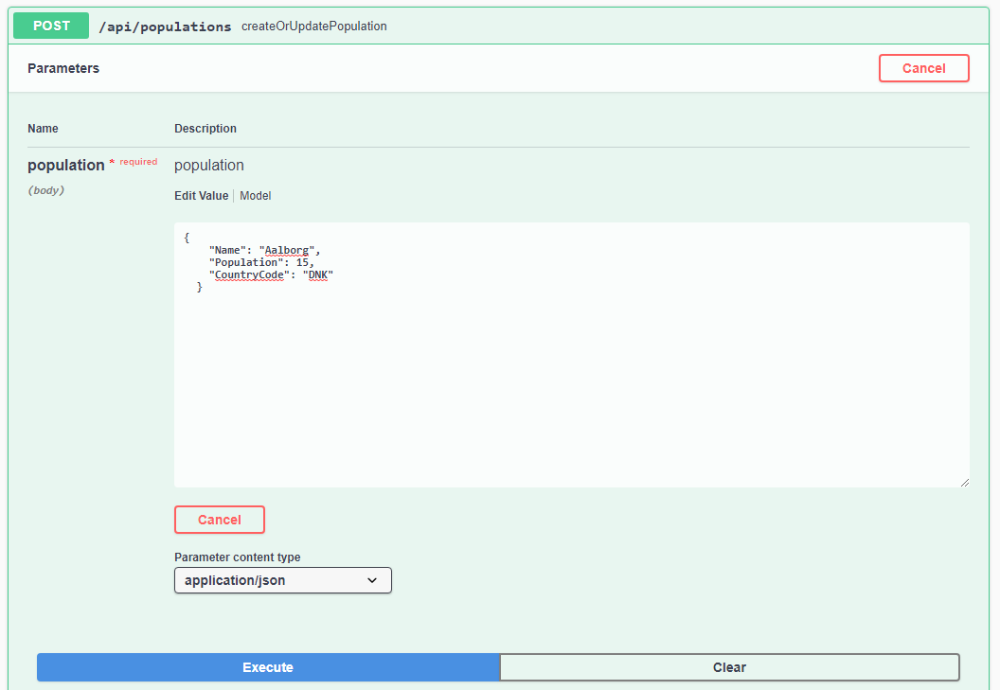

**Response after population update:**
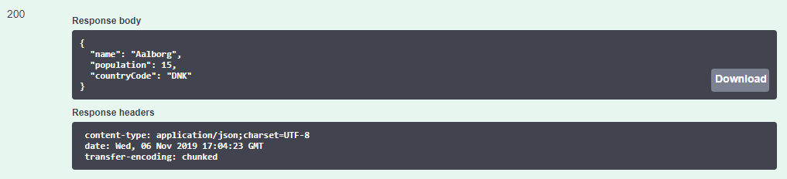

...

**Query all data to verify update and validate no duplicate records.**
**Duplicate records do not exist, as the database ID is the serialized combination of values for "name"+"countryCode":**
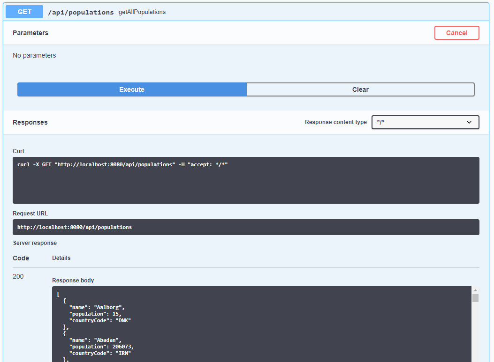

...

**Delete a population record:**
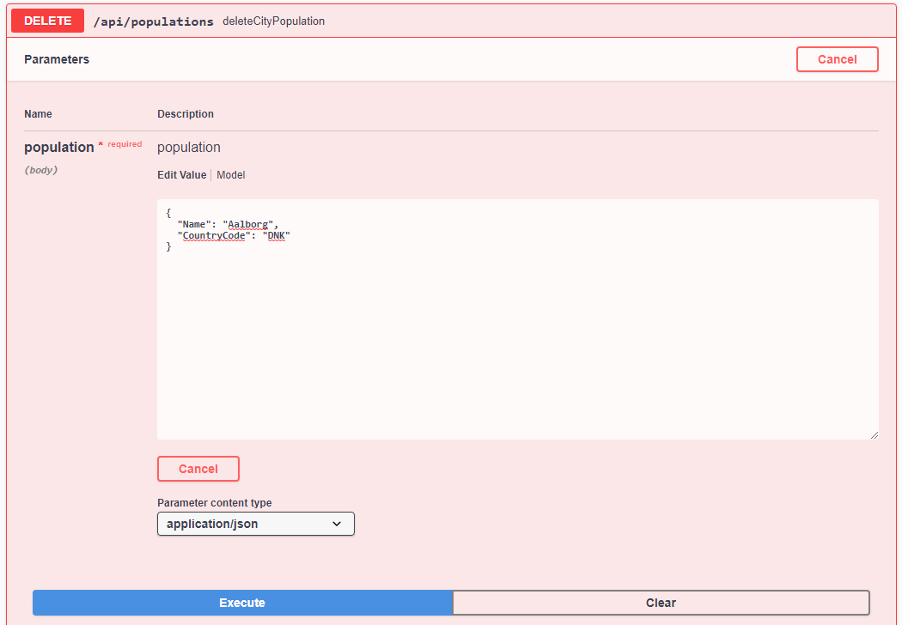

**Response after population delete:**
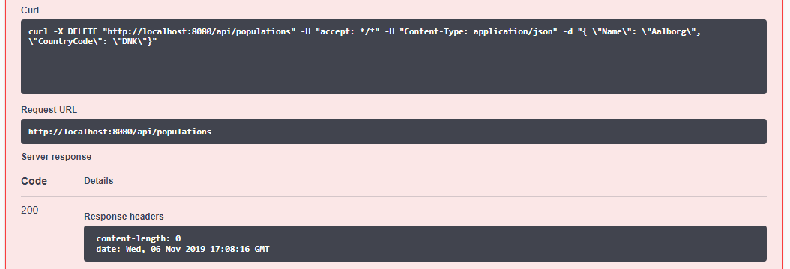

...

**Query all data to verify population was deleted:**
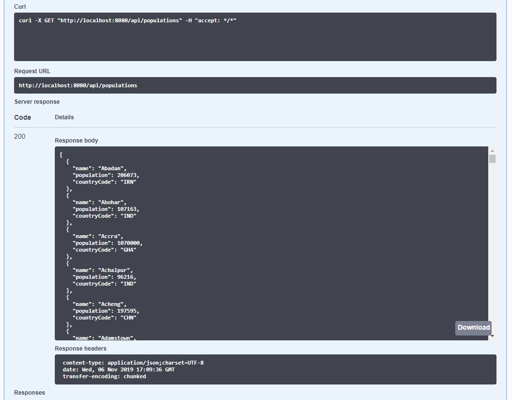
